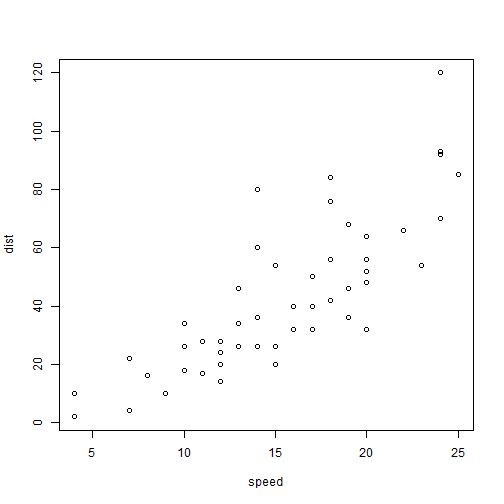

index
========================================================
author: Xavier Bryant
date: 24/02/2021
autosize: true
font-import: https://fonts.googleapis.com/css2?family=Luckiest+Guy&display=swap
font-family: Luckiest Guy
css: custom.css

About Presentation
========================================================

RPresentation is a special Markdown dialect used to create HTML presentations with **RStudio**.

The file is saved with extension .Rpres and is compiled using RMarkdown and knitr packages.

It generates two files .md and .html.
The latter may be open in any web browser.

RPresentation requires the knitr package (version 1.2 or higher)


First Slide
========================================================
type: exclaim

For more details on authoring R presentations please visit [link](https://support.rstudio.com/hc/en-us/articles/200486468).

- Bullet 1

<li class="fragment fade-in" > hello </li>

- Bullet 2
- Bullet 3

~~this text will be red~~ 


Slide With Code
========================================================
type: exclaim


```r
opts_chunk$set(cache=TRUE)
summary(cars)
```

```
     speed           dist       
 Min.   : 4.0   Min.   :  2.00  
 1st Qu.:12.0   1st Qu.: 26.00  
 Median :15.0   Median : 36.00  
 Mean   :15.4   Mean   : 42.98  
 3rd Qu.:19.0   3rd Qu.: 56.00  
 Max.   :25.0   Max.   :120.00  
```


Slide With Code 2
========================================================
type: exclaim

first column

```r
1:10
```

```
 [1]  1  2  3  4  5  6  7  8  9 10
```
***
second column

```r
(1:10)^2
```

```
 [1]   1   4   9  16  25  36  49  64  81 100
```
      
Slide With Plot
========================================================

<small>Smaller font sentence.</small>

<span style="font-weight: bold;">Pay attention to this!</span>





Slide With Plotly
========================================================


<style>
  .p_iframe iframe {
    width:90%;
    height:576px;
}
</style>

<div class="p_iframe">
<iframe frameborder="0" seamless='seamless' scrolling=no src="plotly.html"></iframe>
</div>


========================================================

